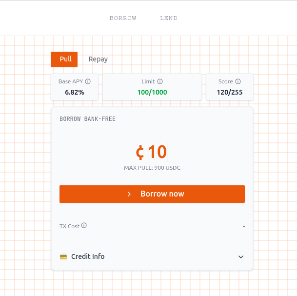

<p align="center">
  
</p>

<h1 align="center">Lendoor — Reputation‑Based Money Market</h1>

<p align="center">
  <strong>Lendoor</strong> is a decentralized money market on <strong>Aptos</strong> that enables <strong>uncollateralized lending</strong> using <strong>zkMe</strong> proof‑of‑identity and a built‑in <strong>credit score</strong>. Capital is split into <strong>risk tranches</strong> (Senior / Junior) with a configurable waterfall.
</p>


> This repository contains:
> - **Move packages** (core protocol + configs + utilities)
> - **Frontend** (Vite + React)
> - **Backend** (NestJS API; integrates with zkMe for proof handling)

---

## 🔍 What It Does

**Goal:** Unlock **credit without collateral** on Aptos.

**Borrowers** present zkMe proofs that attest to identity and creditworthiness (without revealing sensitive data).  
**Lenders** deposit into **Senior** or **Junior** tranches and earn risk‑adjusted yield. Protocol fees and tranche fees are configurable on‑chain.

---

## 🧪 How It Works

1. **Identity & Credit (zkMe)**  
   Users produce a zkMe proof that attests to identity/KYC and a **credit score**. The backend verifies this proof and allows the app to size a **borrow limit**.

2. **On‑chain Configuration**  
   The protocol has on‑chain configs for **interest rate curve**, **reserve parameters**, and **tranche split (bps + junior address)**. Admins are checked by `controller_config` during updates.

3. **Borrow / Lend Flow**  
   - **Lenders** choose **Senior** (lower risk) or **Junior** (higher risk) liquidity.  
   - **Borrowers** draw credit against zkMe‑backed score, paying variable rates determined by the utilization‑based interest model.  
   - A **tranche manager** syncs profit/loss and mints fee shares to the junior address according to configured bps.

---

## 🧱 Protocol Architecture (Move)

This repo uses **3 Move packages** to keep code modular:

```
/contracts
├─ Move.toml
├─ sources/                         ← core (lendoor) modules
│  ├─ controller.move
│  ├─ controller_config.move
│  ├─ credit_manager.move
│  ├─ fa_to_coin_wrapper.move
│  ├─ junior_vault.move
│  ├─ profile.move
│  ├─ reserve.move
│  ├─ reserve_details.move
│  ├─ tranche_config.move
│  └─ tranche_manager.move
└─ packages/
   ├─ util_types/                   ← shared utilities (decimal, maps, iterable table, math utils, pair)
   │  └─ sources/
   │     ├─ decimal.move
   │     ├─ iterate_table.move
   │     ├─ map.move
   │     ├─ math_utils.move
   │     └─ pair.move
   └─ lendoor_config/              ← protocol config types & setters
      └─ sources/
         ├─ interest_rate.move
         ├─ reserve_config.move
         └─ utils.move
```

### Key Modules (Core package: `lendoor`)

- `controller_config.move`  
  Stores the **admin** address and enforces access control. Typical use pattern:
  ```move
  public fun assert_is_admin(addr: address) acquires ControllerConfig {
      assert!(is_admin(addr), ECONTROLLER_ADMIN_MISMATCH);
  }
  ```
  > Many entry functions (e.g., `update_reserve_config`, `update_interest_rate_config`) call `assert_is_admin` to gate updates.

- `tranche_config.move`  
  Stores **per‑asset** junior address and tranche bps. We use `aptos_std::type_info` to key by the asset type:
  ```move
  struct TrancheCfg has copy, drop, store {
      junior_addr: address,
      tranche_bps: u16,
  }
  ```
  > The storage address is `@lendoor` (core package’s address), so ensure your **named address** `lendoor` is resolved to your publisher address when compiling/publishing.

- `tranche_manager.move`  
  Tracks **total assets**, detects **profit/loss deltas**, and can **mint junior fee shares** or apply external losses. It uses `reserve_details` for totals and synchronizes before applying effects.

- `reserve.move` & `reserve_details.move`  
  Handle the money‑market mechanics: deposits, withdrawals, borrow/repay, fees, interest accrual, and conversion between **LP** shares and underlying `Coin<T>` amounts.

- `controller.move`, `credit_manager.move`, `profile.move`, `fa_to_coin_wrapper.move`, `junior_vault.move`  
  Extensions around roles, user bookkeeping, optional FA wrappers, and junior tranche vault flows.

### Config Package (`lendoor_config`)

- `interest_rate.move`  
  Defines `InterestRateConfig` (min/optimal/max borrow rate, optimal utilization) and emits update events.

- `reserve_config.move`  
  Defines `ReserveConfig` (LTV, liquidation thresholds/bonuses/fees, reserve ratios, deposit/borrow limits, flags).

- `utils.move`  
  Helpers for config creation or validation.

> The core package imports these types; admin paths update them via gated entry functions.

### Utilities Package (`util_types`)

- `decimal.move`  
  Fixed‑point arithmetic with **1e9 scale** (`SCALE = 1_000_000_000`), plus helpers like `from_bips`, `mul_div`, etc.

- `iterate_table.move`, `map.move`  
  Thin wrappers on `aptos_std` maps to support iteration or updates without requiring `drop` on `V` unnecessarily.

- `math_utils.move`  
  Convenience math: `mul_millionth_u64`, `mul_percentage_u64`, `u64_max()`.

- `pair.move`  
  Generic `Pair<A, B>` with convenience accessors.

---

## 🧰 Dev Environment

### Prerequisites
- Node 22+
- Yarn
- Aptos toolchain available via `@aptos-labs/ts-sdk` (the scripts use the CLI entry wrapped by the SDK)

### 🚀 Smart Contracts Deploy (Move, Aptos)

We split publishing into **three steps** to make dependencies explicit and keep payloads small. All scripts write object addresses to `.env`.

-  util_types
-  lendoor_config
-  lendoor


> But you can run a single pipeline:
> ```bash
> cd contracts
> cp .env.example .env
> yarn move:publish
> ```
> which deploy the three contracts **sequentially**.

### Required `.env` (under `contracts/`)
```dotenv
# network
VITE_APP_NETWORK=devnet   # or testnet/mainnet

# publisher account
VITE_MODULE_PUBLISHER_ACCOUNT_ADDRESS=0x...
VITE_MODULE_PUBLISHER_ACCOUNT_PRIVATE_KEY=0x...

# will be set by scripts
VITE_UTIL_TYPES_ADDR=0x...
VITE_LENDOOR_CONFIG_ADDR=0x...
VITE_LENDOOR_ADDR=0x...
```

### Troubleshooting
- **Package >60KB**: our scripts use `--included-artifacts none` and chunked publish (when needed) via the SDK CLI wrapper.
- **Unresolved named addresses**: ensure your `Move.toml` in each package has `[addresses]` with the **symbols** you reference (`lendoor`, `lendoor_config`, `util_types`). The publish scripts resolve them to concrete addresses.

### 🖥 Frontend

A lightweight React app for **Borrow** and **Lend**:
```bash
cd frontend
yarn install
cp .env.example .env
yarn dev
```
- Wallet connect, tranche views, basic KPIs (Base APY, Limits, Scores, Senior/Junior APY).
- Calls the backend for zkMe proof flow and the contracts for on‑chain state.

### 🛠 Backend (NestJS)

The backend provides endpoints to handle the **zkMe** credential flow (issue, verify, and store proof status), then your frontend can gate borrowing with that status.

```bash
cd backend
yarn install
cp .env.example .env
yarn dev
```

---

## 🧪 Selected Code Notes

### Admin‑Gated Config Updates
```move
public entry fun update_reserve_config<Coin0>(
    admin: &signer,
    loan_to_value: u8,
    liquidation_threshold: u8,
    liquidation_bonus_bips: u64,
    liquidation_fee_hundredth_bips: u64,
    borrow_factor: u8,
    reserve_ratio: u8,
    borrow_fee_hundredth_bips: u64,
    withdraw_fee_hundredth_bips: u64,
    deposit_limit: u64,
    borrow_limit: u64,
    allow_collateral: bool,
    allow_redeem: bool,
) {
    controller_config::assert_is_admin(signer::address_of(admin));
    let new_reserve_config = reserve_config::new_reserve_config(
        loan_to_value,
        liquidation_threshold,
        liquidation_bonus_bips,
        liquidation_fee_hundredth_bips,
        borrow_factor,
        reserve_ratio,
        borrow_fee_hundredth_bips,
        withdraw_fee_hundredth_bips,
        deposit_limit,
        borrow_limit,
        allow_collateral,
        allow_redeem,
    );
    reserve::update_reserve_config<Coin0>(new_reserve_config);
    event::emit(UpdateReserveConfigEvent<Coin0> {
        signer_addr: signer::address_of(admin),
        config: new_reserve_config,
    });
}
```
- Uses `controller_config::assert_is_admin` to gate.  
- Emits an event with the new config struct.

### Tranche Registry (Per‑Asset)
```move
struct TrancheCfg has copy, drop, store { junior_addr: address, tranche_bps: u16 }

public entry fun set_for<Coin0>(
    admin: &signer,
    junior_addr: address,
    tranche_bps: u16
) acquires TrancheByAsset {
    controller_config::assert_is_admin(signer::address_of(admin));
    let s = borrow_global_mut<TrancheByAsset>(@lendoor);
    let key = type_of<Coin0>();
    if (table::contains(&s.map, key)) {
        let cfg_ref = table::borrow_mut(&mut s.map, key);
        *cfg_ref = TrancheCfg { junior_addr, tranche_bps };
    } else {
        table::add(&mut s.map, key, TrancheCfg { junior_addr, tranche_bps });
    };
}
```
- Stores **junior** parameters keyed by `Coin0` type via `type_of<Coin0>()`.

---

## 📁 Repo Structure (Monorepo)

```
/backend        → NestJS API (zkMe integration, proof flow)
/contracts      → Move packages (lendoor core, lendoor_config, util_types) + publish scripts
/frontend       → Vite + React + Tailwind (Borrow / Lend UI, KPIs)
```

---

## 🧭 Roadmap

- Additional zkMe attributes / credit factors.
- More reserve types & assets.
- Liquidation bots & keepers.
- Cross‑package upgrades via object packages (Aptos best practice).

---

## 🤝 Credits

Built with ❤️ by the **Lendoor** team for the **Aptos Control + Move** hackathon.